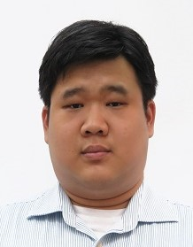
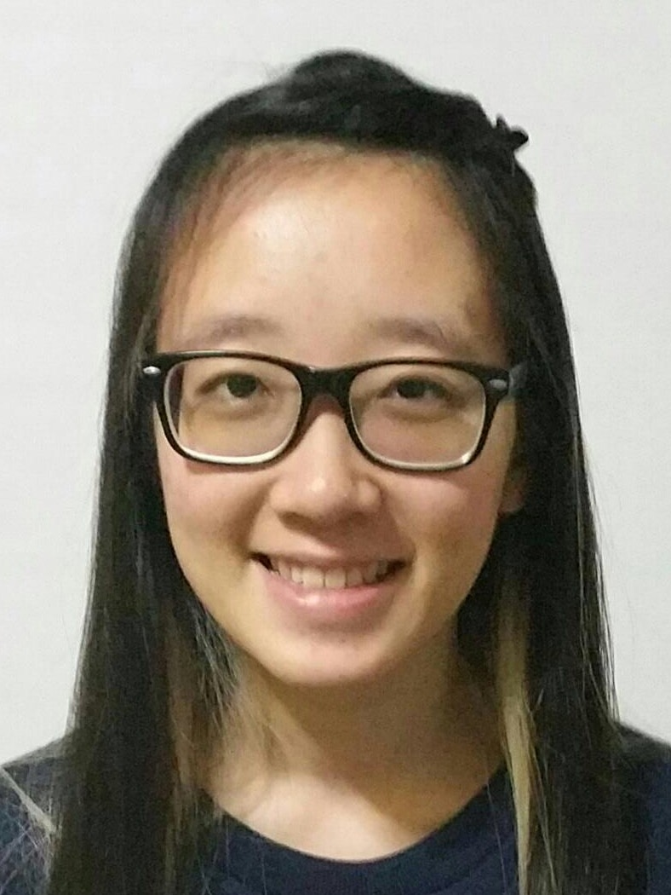
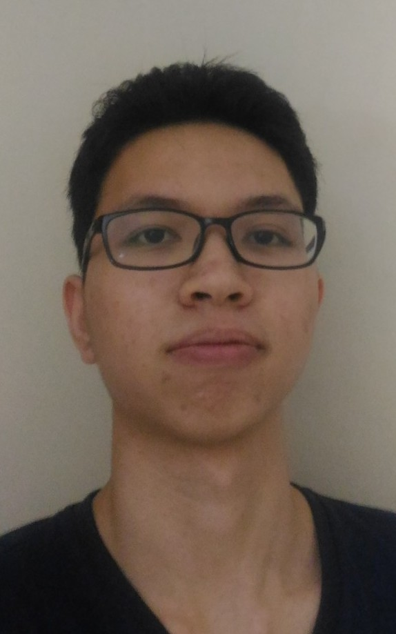

# About Us

We are a team based in the [School of Computing, National University of Singapore](http://www.comp.nus.edu.sg).

## Project Team

#### [Clement Tan](https://github.com/clementtan)  
 
Role:  Documentationem, Testing 
Responsibilities: In charge of Storage component

-----

#### [Marianne Quek Hui Huang](http://github.com/marianne121)
 
Role:  Team lead, Scheduling and tracking 
Responsibilities: In charge of Model component

-----

#### [Quang Dong](http://github.com/nqdung14)
 
Role:  Code quality, Integration 
Responsibilities: In charge of UI, Logic component

-----

# Contributors

We welcome contributions. See [Contact Us](ContactUs.md) page for more info.

* [Akshay Narayan](https://github.com/se-edu/addressbook-level4/pulls?q=is%3Apr+author%3Aokkhoy)
* [Sam Yong](https://github.com/se-edu/addressbook-level4/pulls?q=is%3Apr+author%3Amauris)
