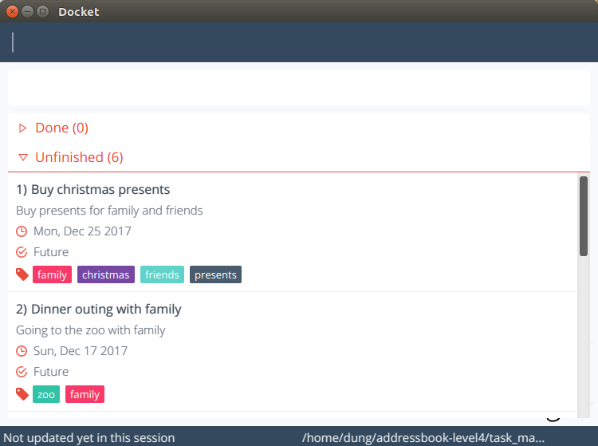
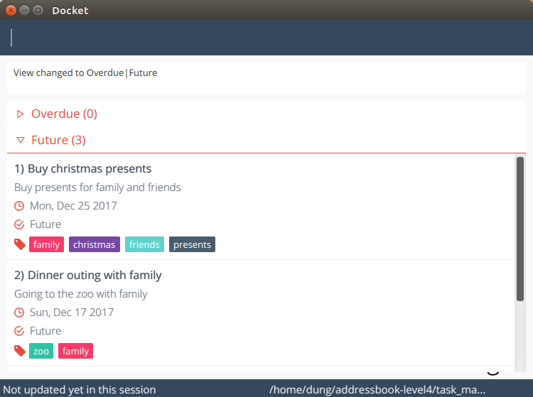

# Docket - User Guide

By : `W13-B2`  &nbsp;&nbsp;&nbsp;&nbsp; Since: `Jun 2016`  &nbsp;&nbsp;&nbsp;&nbsp; Licence: `MIT`

---

1. [About](#user-content-1-about)
2. [Quick Start](#user-content-2-quick-start)
3. [Features](#user-content-3-features)
4. [Keyboard Shortcuts](#user-content-4-keyboard-shortcuts)
5. [FAQ](#user-content-5-faq)
6. [Command Summary](#user-content-6-command-summary)

## 1. About
Ever had the feeling that you are forgetting to do something important? Tired of always
forgetting events because you forgot to write them down? Docket is the application that 
will solve all your problems. 

Docket is a simple and lightweight application that will keep track of your tasks for you.
It will tell you if a task's due date is coming in manner that is quick and easy to understand.

In contrast to other comprehensive task managers out there, Docket is simple and 
straightforward. It has one mode of input with a boiled down interface. Let's get started
on simplifying the way you handle tasks now.

## 2. Quick Start

1. Ensure you have Java version `1.8.0_60` or later installed in your Computer. 
2. Download the latest `taskmanager.jar` from the [releases](../../../releases) tab.
3. Copy the file to the folder you want to use as the home folder for your Task Manager.
4. Double-click the file to start the app. The GUI should appear in a few seconds.
   > 

5. Type a command in the command box and press <kbd>Enter</kbd> to execute it.  
   Some example commands you can try:
   * **`help`** : will open the help window.
   * **`list`** : lists all tasks
   * **`add`**` Meeting dl/15-05-2017 ds/Meeting Room 1 t/important` :
     adds a task named `Meeting` to the Task Manager.
   * **`delete`**` 3` : deletes the 3rd task shown in the current list
   * **`exit`** : exits the app
6. Refer to the [Features](#features) section below for details of each command. 

## 3. Features

> **Command Format**
>
> * Words in `UPPER_CASE` are the parameters.
> * Items in `SQUARE_BRACKETS` are optional.
> * Items with `...` after them can have multiple instances.
> * Parameters can be in any order.
> * Date and time can be in natural language format

## 3.1. Viewing help : `help`

When you are unsure about the commands used by the program, 
use this command to bring up a list of commands you can use. 
This is also displayed when an incorrect command is entered. 
Format: help

> Is also displayed when an incorrect command is entered

## 3.2. Adding a task: `add`

This command adds a task to your task list to keep track of it. 
Enter the name, the deadline, and a brief description of the 
task you want to keep track of. There can be more than one tags 
per task 
Format: add TASKNAME [dl/DATE&TIME] [ds/DESCRIPTION] [t/TAG]
> Tasks includes:
> * Event tasks where deadlines include a specific timing
> * Floating tasks where deadlines are not specified
> * Normal tasks with deadlines

Examples:

* `add Make payment dl/01/08/2017 ds/Pay credit card bills`
* `add Lose weight dl/from 12/12/2017 to 24/12/2017`
* `add Performance rehearsal dl/today 10pm t/important t/urgent`
* `add Complete project dl/12/12/2017`
* `add Buy a cake t/hungry`

## 3.3. Listing all tasks: `list`

Shows you a list of all tasks with an index number attached. 
This index number is associated with a task as it is seen on the list. 
You will need this index number to use some of the tasks below. 
Format: list

## 3.4. View tasks : `view`

Changes the type of view seen on the task manager so that you can 
better differentiate the time that the task is due. The tasks are 
seperated based on the status of the task. The statuses of the tasks, 
if are still not done, are based on the time left to their due date.
You can specify which tabs you want to see on the screen by entering
the name of the tab together with the command. 
Format: view [all|calendar|done|floating|overdue|today|tomorrow|future]

Examples:

* `view`
* `view all`
* `view today tomorrow`
* `view overdue future`
   > 

## 3.5. Modifying a task: `edit`

You can change the details of a task that you are currently 
keeping track of with the edit command. If you want remove details 
from the select task, enter the prefix for the field and leave the 
parameter empty. 
Format: edit INDEX [TASKNAME] [dl/DATE&TIME] [ds/DESCRIPTION] [t/TAG][-p]

Examples:

* `edit 3 buy eggs dl/29-02-2017 ds/as soon as possible t/dinner`
* `edit 3 ds/`
* `edit 1 tie shoelace dl/25-12-2017 t/urgent`
* `edit 1 dl/ t/`

## 3.6. Delete a task: `delete`

No longer need to do a task? Removes it from the task list 
to forget about it. 
Format: delete INDEX

Examples:

* `delete 1`

## 3.7. Undo a command: `undo`

Made a mistake? Use this command to quickly reverse the 
changes made with the last command used.  
Format: undo

## 3.8. Redo a command: `redo`

Changed your mind? Use this command to quickly reapply 
the changes that were removed with undo command. 
This can only be used after an undo command.  
Format: redo

## 3.9. Finding all tasks using keyword or deadline: `find`

Helps you quickly finds tasks whose name, description or tags contain 
any of the given keywords. The results will come with an index number 
attached. The search is case insensitive. Also, the order 
of the keywords does not matter. 
Format: find KEYWORDS|dl/DATE&TIME

Examples:

* `find Project`
* `find dl/12-08-2017`

## 3.10. Marking entries as done : `mark`

After completing a task, use this command to mark a task as completed 
Format: mark INDEX

Examples:

* `mark 3`

## 3.11. Clearing all entries : `clear`

Clears your list of tasks to start from a clean slate or remove all tasks that have been marked as done. Be warned, once deleted, the tasks are lost forever (unless you use the undo command). 
Format: clear all|done

Examples:

* `clear all`
* `clear done`

## 3.12. Sorting the list of tasks : `sort`

Arranges your tasks in chronological order. 
Format: sort name|deadline

Examples:

* `sort name`
* `sort deadline`

## 3.13. Saving the data

Application data are saved onto hard drive automatically after any commands are executed that changes the data.
There is no need to manually save the data. However, you can change the location of the storage file that holds the data for Docket. This command creates a new file if the 
file name is not specified. 
Format: set-storage STORAGE_LOCATION

Examples:

* `set-storage C:\Users\Public\Documents\Data\taskmanager.xml`

## 3.14. Exiting the program : `exit`

When you are tired and want to stop tracking tasks for the day, 
use this command to exit the program.  
Format: exit

## 4. Keyboard shortcuts

Learn keyboard shortcuts to make your work with Docket much more efficient and productive.

1. `UP`, `DOWN`:  Views previously typed commands
2. `Alt + 1`, `Alt + 2`, ..., `Alt + 9`:  Expands task lists
3. `PAGE UP`, `PAGE DOWN`:  Scrolls up and down the list of tasks

## 5. FAQ

**Q**: Where do I download the Task Manager Application? 
**A**: The Application can be found at https://github.com/CS2103JAN2017-W13-B2/main to download.

**Q**: Why are there no tasks displayed after I added some tasks? 
**A**: Use the command `list` to display all tasks.

**Q**: Where do I get the INDEX number? 
**A**: The INDEX number is obtained when the “list” or “find” command is used.

**Q**: How do I transfer my data to another Computer? 
**A**: Install the app in the other computer and overwrite the empty data file it creates with
       the file that contains the data of your previous Task Manager folder.

## 6. Command Summary

Command|Format|Example
-------|:-----|:------
**Help**|`help`|`add Make payment dl/01-08-2017  ds/Pay credit card bills`
**Add**|`add TASKNAME dl/DATE [ds/DESCRIPTION]`|
**List**|`list`|
**View**|`view [all,calendar,done,floating,overdue,today,tomorrow,future,unfinished]`|`view all`
**Edit**|`edit INDEX [TASKNAME] [dl/DATE] [ds/DESCRIPTION]`|`edit 3 buy eggs dl/29-02-2017 ds/as soon as possible`
**Delete**|`delete INDEX`|`delete 3`
**Undo**|`undo`|
**Redo**|`redo`|
**Find**|`find [KEYWORDS] [dl/DATE]`|`find James Jake`
**Mark**|`mark INDEX`|`mark 4`
**Clear**|`clear [all,done]`|`clear all`
**Sort**|`sort [name,deadline]`|`sort deadline`
**Set Storage**|`set-storage STORAGE_LOCATION`|`set-storage C:\Users\Public\Documents\Data\ taskmanager.xml`
**Exit**|`exit`|
